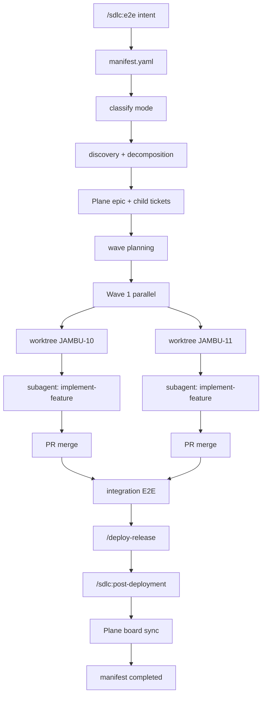

# /sdlc:e2e — End-to-End Orchestration Pipeline

Execute a complete product delivery cycle from natural-language intent to deployed, board-synced implementation. This command is the **orchestrator** — it does not implement code directly. It decomposes work into vertical slices, creates Plane hierarchy, dispatches subagents in isolated worktrees, merges, deploys, and closes all tickets with evidence.

## Usage

```
/sdlc:e2e <intent>
/sdlc:e2e --resume [<run-id>]
/sdlc:e2e --status [--run-id <run-id>]
/sdlc:e2e --force-stage <stage-id> --run-id <run-id>
```

When `<intent>` is provided without `--resume`, the orchestrator **always runs cognitive run resolution first** (see below). Explicit `--resume <run-id>` skips resolution.

Examples:

```
/sdlc:e2e crie em "/reddit" um clone do reddit atual, precisa ter somente as funcionalidades basicas, visual identico e salve os dados localmente em um sqlite

/sdlc:e2e --resume reddit-clone-20260522

/sdlc:e2e continuar o clone do reddit

/sdlc:e2e corrigir validacao de titulo vazio no formulario /blog/new
```

## Reasoning Contract (meta-cognitive)

Before executing any stage, the orchestrator applies this reasoning discipline — derived from the fundamental epistemics of measurement-based delivery:

### 1. Know your target before moving

If the intent involves cloning or matching a reference, **you cannot evaluate conformance without capturing the target first**. A description of what something looks like is not a target — a pixel-accurate screenshot is. Any assertion of visual fidelity made without reference screenshots on disk is a hallucination.

Question to ask before decomposition: *Do I have evidence of what I am building toward?*

### 2. Measure, do not declare

The difference between a working clone and a broken one is not in the code — it is in the observable rendering. Code that imports the correct color hex is not evidence of visual correctness. A screenshot comparison is. Score the delta. If you cannot score it, you do not know.

Question to ask before `visual_gate=PASS`: *Have I compared current rendering against reference pixels at the viewports that matter?*

### 3. Gap → action → re-measure, not gap → description → done

When a visual comparison reveals a delta, the correct response is: identify the minimum change that closes the gap, apply it, re-measure. The incorrect response is to describe the gap, mark it as a warning, and declare success. Declaring PASS before the delta is closed is optimism, not validation.

Question to ask when score < threshold: *What is the single most impactful change that moves the score above threshold?*

### 4. The loop is the feature

A clone is never correct on the first pass. The self-correcting loop (capture → score → gap → patch → re-capture) is not an optional QA step — it is the core mechanism that produces fidelity. Workflows that skip the loop are workflows that ship broken clones and call them done.

### 5. Stop only with evidence in hand

The agent stops and hands off to human review only when:
- Reference screenshots exist on disk
- Current screenshots exist on disk at same viewports
- Fidelity score computed and recorded
- Score ≥ threshold OR max iterations reached with gap report on Plane

Stopping without this is stopping without having done the job.

---

## Orchestrator Contract

You are the **orchestrator**, not the implementer. Your responsibilities:

1. Read and update the run manifest before and after every stage
2. Skip completed/skipped stages (idempotency)
3. Decompose only into **vertical E2E slices** — no loose horizontal tasks
4. Dispatch subagents (Task tool) for implementation; never write feature code in the main worktree
5. Enforce worktree isolation per ticket
6. Record all artifacts, PR URLs, evidence paths in manifest
7. Merge PRs in wave dependency order
8. Close the loop: deploy → post-deploy → board sync → reflect → handoff

**Definition of Done:** Implementation working in production, all Plane tickets Done with descriptions/status/PRs/evidence attached, manifest status `completed`, handoff recorded.

---

## ADR-009 — Composition, Not Reimplementation

`/sdlc:e2e` is a **composer** of existing workflows (`.sdlc/workflows/README.md`). It MUST NOT reimplement planning, coding, review, QA, or deployment logic inline.

| sdlc:e2e stage | Delegates to | Agent (Task subagent_type) |
|---|---|---|
| decomposition | `/plan` | `planner` |
| plane-hierarchy | `/spec:create` per slice | `spec-writer` |
| architecture | `/plan` on master spec | `planner` |
| **execution (per ticket)** | **`/implement-feature`** | **`Implementer`** (runs full `feature-flow.yaml`) |
| deploy | `/deploy-release` | `deployer` |
| post-deploy | `/sdlc:post-deployment` | `deployer` |

**Distributed execution:** Plane epic + child tickets map 1:1 to independent subagent sessions. Wave parallelism = parallel `Task(Implementer)` dispatches. Same protocol whether agents run locally or on Cursor Cloud.

---

## Orchestrator Forbidden Actions (hard gate — ADR-009)

The orchestrator session MUST NOT:

1. **Write or edit `app/` code** — all implementation happens inside ticket worktrees via subagents
2. **Skip `Task(subagent_type="Implementer")`** for any ticket in `execution` stage
3. **Consolidate multiple tickets** into one worktree or one PR
4. **Mark decomposition/architecture** complete without dispatching `Task(planner)` (or equivalent agent session)
5. **Mark ticket `done` or `ready_for_review`** without `register-subagent-dispatch` + full `feature-flow-stage` chain
6. **Mark `execution` / `wave-complete` / `mark-done`** without deterministic gate PASS

Violation → manifest `validate` FAIL. Run stays `blocked` until tickets re-executed via protocol.

---

## Deterministic Gates (mandatory — no bypass except `--force`)

Implemented in `.sdlc/bin/sdlc_gate_check.py`, enforced by `.sdlc/bin/sdlc_e2e_manifest.py`.

**Orchestrator MUST NOT mark stages/tickets complete without gate PASS.**

| Transition | Gate requirements |
|---|---|
| `stage-start <stage>` | `gate_stage_order` — all prior non-skipped stages `completed`/`skipped`; `gate_plane_hierarchy_complete` for architecture+; execution also requires `waves` + `register-subagent-dispatch` on all slice tickets |
| `stage-complete workspace-rebind` | `rebind-report.md` exists; `gate_ci_target_aligned` PASS (deploy/release/dependency-updates reference `workspace.target_root`) |
| `stage-complete <stage>` | Same order + hierarchy gates; discovery requires reference PNGs on disk; execution requires all slice tickets `done` with full ticket gates; integration requires `integration-report.md` + joint E2E PASS; deploy requires CI alignment + staging smoke PASS or `orchestrator.staging_url`; post-deploy requires evidence manifest + production HTTP 200; reflect requires `reflect-report.md` PASS; board-sync requires `plane_evidence_uploaded` |
| `register-subagent-dispatch` | Required **before** ticket enters `in_progress` implementation |
| `feature-flow-stage` × 5 | planning, implementation, review, qa, pr_creation → sets `feature_flow_complete` |
| `update-ticket --field status --value done\|ready_for_review` | `subagent_dispatched=true`, `feature_flow_complete=true`, `qa_verdict=PASS`, `visual_gate=PASS`, evidence_dir with manifest.md + PNG, `pr_url`, `review_url`, **`plane_state_synced=true`** (auto-sync via `plane_ticket_state.py`) |
| `update-ticket --field <bool> --value true\|false` | Boolean fields coerced to YAML booleans (`plane_evidence_uploaded`, `feature_flow_complete`, etc.) |
| `wave-complete` | All tickets in wave pass ticket gate; no shared worktree/PR across tickets |
| `stage-complete execution` | All vertical-slice tickets `done` with full gates; auto-sets `definition_of_done.implementation_working` |
| `stage-complete deploy` | Auto-sets `definition_of_done.deployed_to_production` when gate PASS |
| `stage-complete board-sync` | `plane_evidence_uploaded=true` on all active tickets; auto-sets evidence/board DoD flags |
| `record-handoff` | Non-stub handoff auto-sets `definition_of_done.handoff_recorded` |
| `mark-done` | All stages complete + all `definition_of_done` flags true; LATEST.md must not be session stub; warns on uncommitted SDLC state |
| `validate` | Always runs `gate_manifest_integrity` — out-of-order completed stages, execution without tickets, `protocol.violation`, worktree/PR isolation |

**Protocol guard (orchestrator defense-in-depth):** `.sdlc/bin/sdlc_protocol_guard.py` blocks edits under `workspace.target_root` and ticket worktrees unless `execution` is `in_progress` and the path belongs to a ticket with `subagent_dispatched=true`. Enforced via `.cursor/hooks/hook_handler.py` (`beforeShellExecution`, `afterFileEdit`). Set `SDL_PROTOCOL_ENFORCE=false` only for infra debugging.

**On gate FAIL:** manifest `status` → `blocked`, `protocol.violation` recorded, exit 1. Use `--force` on `stage-start`/`stage-complete` only for admin recovery.

**Visual gate (greenfield clone):** Playwright spec MUST assert computed CSS (not only DOM testids). Example: `e2e/reddit-visual.spec.ts`.

**Human review handoff:** Agent stops ONLY when:
1. `review_url` live and verified (browser or Playwright screenshot)
2. PR created
3. Plane comment posted with QA summary + links
4. Evidence on disk at `.sdlc/evidence/{TICKET}/` in worktree

**Opção A (architecture):** Feature code in worktree; SDLC manifest/specs/handoffs committed on `main`.

---

## Manifest Control Plane

Every run is tracked in `.sdlc/runs/{run_id}/manifest.yaml`.

```bash
MANIFEST="python3 .sdlc/bin/sdlc_e2e_manifest.py"

# New run
$MANIFEST init --intent "<verbatim intent>" [--run-id slug] [--mode greenfield|feature|fix]

# Resume — prints NEXT_STAGE for orchestrator
$MANIFEST resume [--run-id slug]

# Stage lifecycle
$MANIFEST stage-start <stage-id>
$MANIFEST stage-complete <stage-id> [--artifacts path,path]
$MANIFEST stage-skip <stage-id>      # fix mode auto-skips
$MANIFEST stage-fail <stage-id> --reason "..."

# Ticket/wave registry
$MANIFEST register-epic --ticket JAMBU-N --uuid UUID --spec .sdlc/specs/...
$MANIFEST register-ticket --ticket JAMBU-N --uuid UUID --parent JAMBU-M --wave wave-1 ...
$MANIFEST register-subagent-dispatch --ticket JAMBU-N --agent implementer [--session-id ID]
$MANIFEST feature-flow-stage --ticket JAMBU-N --stage qa
$MANIFEST register-wave --id wave-1 --tickets JAMBU-10,JAMBU-11 --parallel
$MANIFEST wave-complete wave-1
$MANIFEST update-ticket --ticket JAMBU-N --field pr_url --value https://...

# Completion
$MANIFEST mark-done
$MANIFEST validate
$MANIFEST list-runs [--active]

# Cognitive run resolution (MANDATORY before init/resume when user gives description only)
$MANIFEST resolve --query "<user description>"
$MANIFEST resolve --query "..." --json
```

**Idempotency rules (mandatory):**

| Action | Idempotency check |
|---|---|
| Stage execution | Skip if `stages.{id}.status` is `completed` or `skipped` |
| Plane ticket create | Skip if ticket already in `manifest.tickets` |
| Worktree create | Skip if path exists in `git worktree list` |
| PR create | Skip if `manifest.tickets.{id}.pr_url` is set |
| Evidence upload | Skip if Plane comment references asset IDs for this ticket |
| Spec write | Overwrite only if `--force-stage` or user explicitly requests |

**Resume:** `/sdlc:e2e --resume {run_id}` loads manifest, calls `$MANIFEST resume`, executes from `NEXT_STAGE` forward. Never repeat completed work.

If the user omits `run_id`, run **Cognitive Run Resolution** (below) before resuming.

---

## Cognitive Run Resolution (mandatory gate)

When the user invokes `/sdlc:e2e` with a natural-language description and no explicit `--resume <run-id>`, the orchestrator MUST resolve whether to **resume an existing run** or **start a new one**.

This gate runs **before** Stage 0 (init/resume). Do not call `init` or assume a run until resolution completes.

### Step R1 — List active runs

```bash
$MANIFEST list-runs --active
$MANIFEST resolve --query "<verbatim user message>"
```

Active runs = manifest status in `pending`, `in_progress`, `blocked`, `paused`. Completed runs are excluded unless the user names the `run_id` explicitly.

### Step R2 — Interpret resolve output

| `RESOLVE_ACTION` | Orchestrator behavior |
|---|---|
| `resume` + `CONFIDENCE=high` | Set active run to `RESOLVE_RUN_ID`, proceed with `$MANIFEST resume`. **Do not ask.** |
| `confirm` | Present top candidate(s) to user. **STOP until user confirms** run or chooses new. |
| `ambiguous` | Present numbered candidate list from `CANDIDATES`. **STOP until user picks** run, or confirms new run. |
| `new` + `CONFIDENCE=high` | Proceed to `$MANIFEST init --intent "..."`. **Do not ask** unless `ACTIVE_RUNS > 0` and partial overlap exists. |
| `none` | Tell user no active run matches continuation intent. Offer: list active runs, start new, or provide `--resume <run-id>`. **STOP.** |

### Step R3 — Confirmation format (when not obvious)

When `RESOLVE_ACTION` is `confirm` or `ambiguous`, present:

```markdown
## Run Resolution

Encontrei {N} trabalho(s) ativo(s). Qual devo continuar?

| # | Run ID | Status | Stage | Epic | Intent |
|---|---|---|---|---|---|
| 1 | reddit-clone-20260522 | in_progress | execution | JAMBU-15 | clone /reddit ... |
| 2 | blog-fix-20260521 | blocked | execution | JAMBU-12 | corrigir validacao ... |

- Responda com o número ou `run_id` para continuar.
- Responda `novo` para iniciar um run novo (descartando resume).
- Responda `cancelar` para abortar.
```

Use `AskQuestion` or plain stop-and-ask when multiple candidates exist. Do not guess.

### Obvious resume (no confirmation)

Auto-resume without asking when ANY of:

1. `RESOLVE_ACTION=resume` and `CONFIDENCE=high`
2. User passed explicit `--resume <run-id>` (skip resolve entirely)
3. Exactly one active run AND query contains continuation keywords (`continuar`, `retomar`, `resume`, `seguir`, …)
4. Query contains exact `run_id` slug and that run is active

### Obvious new run (no confirmation)

Auto-init without asking when:

1. `RESOLVE_ACTION=new` and `CONFIDENCE=high` and `ACTIVE_RUNS=0`
2. Query is clearly greenfield creation AND zero active runs match (`best score < 25`)

### Must confirm (never auto-guess)

- Two or more active runs with scores within 25 points of each other
- Creation intent (`crie`, `create`, `novo`) but strong overlap with existing in-progress run
- Continuation intent but `RESOLVE_ACTION=ambiguous` or `none`
- User description matches completed run only — offer resume of completed vs new

### After user confirms

```bash
$MANIFEST resume --run-id {chosen_run_id}
# or
$MANIFEST init --intent "..." [--run-id slug]
```

Update `ACTIVE` pointer via `resume` / `init` (both call `set_active`).

### Example flows

**Obvious — single active run:**
```
User: /sdlc:e2e continuar o reddit
→ resolve: RESOLVE_ACTION=resume CONFIDENCE=high (single active run)
→ resume reddit-clone-20260522, no question
```

**Ambiguous — multiple runs:**
```
User: /sdlc:e2e continuar implementacao
→ resolve: RESOLVE_ACTION=ambiguous
→ present table, STOP, wait for user pick
```

**Duplicate risk:**
```
User: /sdlc:e2e crie clone do reddit
→ resolve: RESOLVE_ACTION=confirm (reddit-clone already in_progress)
→ ask: "Run reddit-clone-20260522 ja existe em execution. Continuar ou criar novo?"
```

---

## Mode Classification

Before discovery, classify the intent:

| Mode | When | Stages skipped |
|---|---|---|
| `greenfield` | New route/product from scratch (e.g. `/reddit` clone) | none |
| `feature` | Vertical feature in existing app (e.g. "add comments to blog posts") | none (lighter discovery) |
| `fix` | Correction, bug fix, small adjustment | discovery, decomposition, plane-hierarchy, architecture, wave-planning, integration |

```bash
$MANIFEST set-mode fix   # after classify stage
```

Fix mode flow: hydrate → classify → execution (single ticket, hotfix worktree) → deploy → post-deploy → board-sync → reflect.

Fix mode does NOT require deep requirements analysis. Scope is bounded by the stated correction.

---

## Stage Execution Protocol

Read `.sdlc/workflows/e2e-orchestration-flow.yaml` for the canonical stage list. Execute in order. For each stage:

```bash
$MANIFEST stage-start <stage-id>
# ... execute stage work ...
$MANIFEST stage-complete <stage-id> --artifacts <paths>
```

### Stage 0 — Cognitive Resolution, Init, or Resume

**If user did not pass explicit `--resume <run-id>`:**

```bash
$MANIFEST resolve --query "<verbatim user intent>"
```

Apply Cognitive Run Resolution gate (above). Only proceed when action is determined.

**New run (after resolve → new):**

```bash
$MANIFEST init --intent "<user intent>"
```

Extract from intent (write to manifest via `set-target`):
- `target.route` — e.g. `/reddit`
- `target.reference_url` — e.g. `https://reddit.com`
- `target.persistence` — e.g. `sqlite local`

**Resume (after resolve → resume, or explicit `--resume`):**

```bash
/sdlc:e2e --resume reddit-clone-20260522   # or run_id from resolve output
$MANIFEST resume --run-id reddit-clone-20260522
# Execute from NEXT_STAGE
```

---

### Stage 1 — hydrate

Invoke `/hydrate-context`. Read INDEX, LATEST handoff, sdlc.yaml, memories, ADRs.

---

### Stage 2 — classify

Analyze intent. Write decision to `.sdlc/runs/{run_id}/mode-decision.md`:

```markdown
# Mode Decision — {run_id}

## Intent
{verbatim}

## Classification: {greenfield|feature|fix}

## Rationale
{why this mode}

## Target
- Route: {route}
- Reference: {url}
- Persistence: {type}

## Vertical slice hypothesis
{initial list of E2E slices if greenfield/feature}
```

```bash
$MANIFEST set-mode {mode}
$MANIFEST stage-complete classify --artifacts .sdlc/runs/{run_id}/mode-decision.md
```

---

### Stage 3 — discovery (skip in fix mode)

Discovery produces **ground truth**: pixel-accurate reference screenshots that all subsequent QA validation is measured against. Without screenshots on disk, this stage is NOT complete — text descriptions of colors are not evidence.

#### 3.1 — Mandatory reference capture (blocking gate)

Navigate to `target.reference_url`. Capture and save to `.sdlc/runs/{run_id}/reference-screenshots/`:

| File | Viewport | Method |
|---|---|---|
| `reference-desktop-1280.png` | 1280×900 | `browser_resize` → `browser_take_screenshot` |
| `reference-tablet-768.png` | 768×1024 | `browser_resize` → `browser_take_screenshot` |
| `reference-mobile-375.png` | 375×812 | `browser_resize` → `browser_take_screenshot` |

**If browser MCP times out or returns blank:** retry once, then use Playwright headless:

```bash
npx playwright screenshot --viewport-size="1280,900" {url} \
  .sdlc/runs/{run_id}/reference-screenshots/reference-desktop-1280.png
```

**If reference URL is unreachable:** capture cached/archived version (Wayback Machine at `https://web.archive.org/web/*/{url}`), document the fallback in the report, and store whatever is captured. A text-only discovery is a FAIL — it produces an imaginary target that cannot be measured against.

**Gate:** `reference-screenshots/` must contain at least one non-empty PNG before proceeding to decomposition. Verify:

```bash
ls -la .sdlc/runs/{run_id}/reference-screenshots/*.png | awk '$5 > 1000'
# Must return at least one file > 1KB
```

#### 3.2 — DOM introspection (after screenshots)

With screenshots stored, extract ground-truth tokens from computed styles — not from static documentation:

```javascript
// Run in browser console or via browser_snapshot + CSS extraction
getComputedStyle(document.body).backgroundColor        // bg-primary
getComputedStyle(document.querySelector('.Post')).backgroundColor  // card bg
document.querySelector('h2[slot="title"]')?.style     // title typography
```

Extract: background colors (hex), font families, font sizes, border radii, spacing. Record verbatim from computed values, not from Reddit design system docs.

#### 3.3 — Interaction trace (core flows)

For each core user flow, navigate and capture a screenshot at the interaction point:

| Flow | Screenshot file |
|---|---|
| Home feed loaded | `reference-flow-feed.png` |
| Post detail open | `reference-flow-post-detail.png` |
| Submit form | `reference-flow-submit.png` |

These become the **per-flow reference targets** for the visual fidelity loop (Stage 8.3).

#### 3.4 — Discovery report

Write `.sdlc/runs/{run_id}/discovery-report.md`:

```markdown
# Discovery Report — {run_id}

## Reference
URL: {url} | Captured: {ISO8601} | Method: live | fallback: {none|playwright|wayback}

## Screenshots on disk
- reference-screenshots/reference-desktop-1280.png — {file size}
- reference-screenshots/reference-tablet-768.png — {file size}
- reference-screenshots/reference-mobile-375.png — {file size}

## Visual Identity (computed, not assumed)
| Token | Computed value | Element sampled |
|---|---|---|
| bg-primary | rgb(11,20,22) | document.body |
| card-bg | rgb(26,26,27) | .Post |

## Layout structure (describe what is visible in reference-desktop-1280.png)
{describe exactly what you see in the screenshot — column layout, header height, card structure}

## Component Inventory
| Component | Visible in screenshot? | Behavior observed |
|---|---|---|

## Core User Flows
1. {flow}: {trigger → observable result} — screenshot: reference-flow-{name}.png

## Scope contract
Included: {list — must be testable in E2E}
Excluded: {list — must not be asserted in QA}
```

**Prohibited content in discovery report:** color tokens sourced from documentation, design systems, or model training data. All values must come from observed computed styles or pixels on disk.

---

### Stage 4 — decomposition (skip in fix mode)

**Dispatch Planner subagent** — orchestrator MUST NOT write decomposition alone:

```
Task(
  subagent_type="planner",
  description="Decompose {run_id} into vertical slices",
  prompt="
    Read .sdlc/runs/{run_id}/discovery-report.md and intent from manifest.
    Execute /plan for epic scope. Output vertical E2E slices only.
    Write .sdlc/runs/{run_id}/decomposition.md.
    Do NOT implement code.
  "
)
```

Input: discovery report + intent + architecture constraints.

**Vertical slice rules (non-negotiable):**

- Each slice = complete user flow from UI trigger to persisted data to observable output
- Each slice has its own E2E test scenarios
- Each slice can ship independently (may depend on prior wave foundation)
- FORBIDDEN standalone slices: "setup database", "add CSS", "create component library"

Example decomposition for Reddit clone at `/reddit`:

| Slice | E2E flow |
|---|---|
| W1-S1: Foundation | SSR route `/reddit` serves shell with header, sidebar, post feed layout matching reference |
| W1-S2: Schema + persistence | SQLite schema for subreddits, posts, votes; seed data; posts list renders from DB |
| W2-S1: Create post | User submits post form → persisted → appears in feed |
| W2-S2: Voting | User upvote/downvote → count updates → persisted |
| W2-S3: Comments | User adds comment → thread renders → persisted |
| W3-S1: Subreddit navigation | User selects subreddit → filtered feed |

Write `.sdlc/runs/{run_id}/decomposition.md`.

Adjust slice count to intent scope. "Basic functionality only" = fewer slices, not thinner slices.

---

### Stage 5 — plane-hierarchy (skip in fix mode)

Create Plane work item hierarchy.

**Epic (parent):**

```bash
# POST work item — epic
curl -s -X POST \
  -H "X-API-Key: $PLANE_API_KEY" \
  -H "Content-Type: application/json" \
  "https://api.plane.so/api/v1/workspaces/jambuai/projects/5341a48e-1c49-4165-950a-75d34a5e699d/issues/" \
  -d '{"name": "<epic title>", "description_html": "<html>", "priority": "high", "state": "8f6c0c24-e4c8-49a0-9e01-ed90e79e5d13"}'
```

**Child tickets (vertical slices):**

Use Plane work-items API with `parent` field set to epic UUID:

```bash
curl -s -X POST \
  -H "X-API-Key: $PLANE_API_KEY" \
  -H "Content-Type: application/json" \
  "https://api.plane.so/api/v1/workspaces/jambuai/projects/5341a48e-1c49-4165-950a-75d34a5e699d/work-items/" \
  -d '{"name": "<slice title>", "description_html": "<html per plane-ticket template>", "priority": "medium", "state": "8f6c0c24-e4c8-49a0-9e01-ed90e79e5d13", "parent": "<epic-uuid>"}'
```

For each ticket:

1. Write spec at `.sdlc/specs/JAMBU-N-{kebab}.md` (invoke spec-writer skill)
2. Register in manifest: `$MANIFEST register-ticket ...`
3. Create worktree: `git worktree add /home/administrator/workspaces/jambu/worktrees/JAMBU-N-{desc} -b feat/JAMBU-N-{desc}`
4. Register epic: `$MANIFEST register-epic ...`
5. Update `.sdlc/INDEX.md` — Active Work, Specs, Worktrees sections

**Idempotency:** Before creating any ticket, check `manifest.tickets`. If ticket exists, skip creation and proceed to worktree verification.

---

### Stage 6 — architecture (skip in fix mode)

Write `.sdlc/runs/{run_id}/master-spec.md` covering:

- Route structure (`src/pages/reddit/...`)
- Data model (SQLite tables, columns, relations)
- SSR requirements (ADR-005 if SQLite)
- Observability hooks (PostHog events per user action)
- E2E test file structure (`e2e/reddit-*.spec.ts`)

Create ADRs for deviations from defaults. Register in INDEX and architecture.md.

---

### Stage 6b — workspace-rebind (skip in fix mode when target_root unchanged)

After classify or `/sdlc:discovery`, when intent declares a new application path OR `workspace.target_root` differs from `.sdlc/sdlc.yaml`:

```bash
python3 .sdlc/bin/sdlc_workspace_rebind.py --target app --profile astro --run-id {run_id}
$MANIFEST stage-complete workspace-rebind --artifacts .sdlc/runs/{run_id}/rebind-report.md
```

Gate: `rebind-report.md` with Verdict PASS; doctor `workspace:ci-target-aligned` must pass before `wave-planning` or `execution`.

Skip when `target_root` is unchanged (idempotent — mark stage `skipped` with reason in mode-decision.md).

---

### Stage 7 — wave-planning (skip in fix mode)

Group slices into dependency waves. Write `.sdlc/runs/{run_id}/wave-plan.md`.

```bash
$MANIFEST register-wave --id wave-1 --tickets JAMBU-10,JAMBU-11 --parallel --name "Foundation"
$MANIFEST register-wave --id wave-2 --tickets JAMBU-12,JAMBU-13,JAMBU-14 --parallel --depends-on wave-1 --name "Core interactions"
```

Rules:
- Wave N+1 depends on wave N merge completion
- Tickets within a wave execute in parallel (separate worktrees, separate subagents)
- Maximum parallel subagents: 4 (avoid resource exhaustion)

---

### Stage 8 — execution

**Orchestrator role: dispatch only.** No code edits in main workspace.

For each wave in order:

```bash
for ticket in wave.tickets; do
  $MANIFEST register-subagent-dispatch --ticket $ticket --agent implementer
  $MANIFEST update-ticket --ticket $ticket --field status --value in_progress
done
```

**Dispatch subagents (Task tool) — one per ticket, parallel within wave:**

```
Task(
  subagent_type="Implementer",
  run_in_background=true,
  description="JAMBU-N vertical slice",
  prompt="
    Execute /implement-feature JAMBU-N in worktree {path}.
    Worktree: /home/administrator/workspaces/jambu/worktrees/JAMBU-N-{desc}
    Spec: .sdlc/specs/JAMBU-N-{desc}.md

    On each feature-flow stage completion, orchestrator records:
      $MANIFEST feature-flow-stage --ticket JAMBU-N --stage {planning|implementation|review|qa|pr_creation}

    Do NOT skip: planner, implementer, reviewer, QA, PR creation.
    On completion report: pr_url, pr_number, branch, evidence_dir, qa_verdict, review_url
  "
)
```

**Orchestrator waits** for all wave subagents. Records manifest fields from subagent reports only — never self-declares PASS.

#### 8.3 — Visual fidelity (clone mode — composed skill)

When `mode=greenfield` and `target.reference_url` is set, each subagent completion runs the **composed skill** `webdesign-perfect-pixel` before `qa_verdict` or `visual_gate` can be PASS.

**Do not reimplement the protocol inline.** Read and execute:

```
.cursor/skills/webdesign-perfect-pixel/SKILL.md
```

Reference PNGs from discovery (Stage 3) live at `.sdlc/runs/{run_id}/reference-screenshots/`. Copy into ticket evidence before comparison.

**Gate script:**

```bash
python3 .sdlc/bin/visual_fidelity_check.py \
  --reference .sdlc/evidence/{TICKET}/reference \
  --current .sdlc/evidence/{TICKET}/current \
  --contract .sdlc/evidence/{TICKET}/design-contract.md \
  --url http://localhost:4321/{route} \
  --json .sdlc/evidence/{TICKET}/fidelity-report.json
```

**Threshold:** `visual_fidelity_score ≥ 85` (from JSON `combined_score`), `overall_pass: true`. Maximum 3 iterations — then `visual_gate=FAIL`.

Record in manifest:

```bash
$MANIFEST update-ticket --ticket JAMBU-N --field visual_fidelity_score --value {score}
$MANIFEST update-ticket --ticket JAMBU-N --field visual_fidelity_iterations --value {N}
```

On PASS:

```bash
$MANIFEST update-ticket --ticket JAMBU-N --field pr_url --value {url}
$MANIFEST update-ticket --ticket JAMBU-N --field qa_verdict --value PASS
$MANIFEST update-ticket --ticket JAMBU-N --field visual_gate --value PASS
$MANIFEST update-ticket --ticket JAMBU-N --field review_url --value {url}
$MANIFEST update-ticket --ticket JAMBU-N --field status --value ready_for_review
# ↑ auto-syncs Plane → In Review via .sdlc/bin/plane_ticket_state.py
$MANIFEST sync-plane --ticket JAMBU-N   # retroactive fix if Plane drifted
# Human merge → then:
$MANIFEST update-ticket --ticket JAMBU-N --field status --value done
```

```bash
$MANIFEST wave-complete wave-1   # fails if visual_gate not PASS for all wave tickets
```

**Fix mode execution:** Single ticket, `Task(Implementer)` or `Task(Incident Resolver)` — still requires `register-subagent-dispatch`. Visual loop not required unless `target.reference_url` is set.

**Idempotency:** Skip tickets where `manifest.tickets.{id}.status == done` AND `feature_flow_complete == true` AND `visual_gate == PASS`.

---

### Stage 9 — integration (skip in fix mode)

After all waves complete:

1. Identify merge order (wave-1 PRs first, then wave-2, etc.)
2. Merge PRs via `gh pr merge` (LOW risk) or wait for human (MEDIUM/HIGH)
3. Create integration branch if needed for joint validation
4. Run full E2E suite: `cd app && npx playwright test e2e/reddit*.spec.ts`
5. Write `.sdlc/runs/{run_id}/integration-report.md`

If integration E2E fails: create fix ticket, add to manifest as hotfix wave, re-run execution for fix ticket only.

---

### Stage 10 — deploy

Invoke `/deploy-release` with appropriate version bump.

Record deployment URL in manifest orchestrator section.

---

### Stage 11 — post-deploy

Invoke `/sdlc:post-deployment {version}`.

Gate: post-deploy must PASS before board-sync. If FAIL, invoke `/fix-incident` and loop execution → deploy → post-deploy for the fix.

---

### Stage 12 — board-sync

For every ticket in `manifest.tickets` plus epic:

1. Verify Plane state = Done
2. Upload evidence from `.sdlc/evidence/{TICKET}/` to Plane (3-step presigned URL — see implement-feature Step 6.5.3)
3. Post summary comment: PR link, merge SHA, QA manifest, deployment URL
4. Update `.sdlc/INDEX.md`:
   - Move items to completed in ACTIVE_WORK
   - Add QA_EVIDENCE entries
   - Clear completed worktrees from ACTIVE_WORKTREES
5. Update `.cursor/memories/operational-context.md`

Epic ticket comment must link all child tickets, PRs, and deployment URL.

---

### Stage 13 — reflect

Run `/sdlc:reflect` for the epic ticket (or primary ticket in fix mode).

Gate: reflect must PASS before marking run complete.

```bash
$MANIFEST mark-done
$MANIFEST validate   # must return PASS
/handoff
$MANIFEST record-handoff --handoff .sdlc/handoffs/LATEST.md
```

Update manifest (handoff binding is mandatory — not optional YAML edit):

```bash
$MANIFEST record-handoff --handoff .sdlc/handoffs/{timestamp}-{ticket}-{phase}.md
# Sets orchestrator.last_handoff — next sessionStart + resume use this as run continuity anchor
```

---

## Force Stage Override

User explicitly requests re-run of a single stage:

```
/sdlc:e2e --force-stage discovery --run-id reddit-clone-20260522
```

Reset stage status to `pending` in manifest, then execute only that stage. Does not reset downstream stages unless user also forces them.

---

## Parallel Subagent Orchestration Diagram



---

## Vertical Slice Anti-Patterns

Do NOT create these as standalone tickets:

| Anti-pattern | Correct approach |
|---|---|
| "Create SQLite schema" | Include in foundation slice that also renders data |
| "Style Reddit header" | Include in layout slice that also serves route |
| "Add Playwright tests" | QA is part of every implement-feature invocation |
| "Update INDEX.md" | Part of board-sync stage, not a ticket |
| "Fix typo in README" | fix mode, single ticket, no decomposition |

Every ticket must answer: **What user action works end-to-end when this ships?**

---

## Run Directory Structure

```
.sdlc/runs/
  ACTIVE                          # current run_id pointer
  reddit-clone-20260522/
    manifest.yaml                 # control plane
    mode-decision.md
    discovery-report.md
    decomposition.md
    master-spec.md
    wave-plan.md
    integration-report.md
    reference-screenshots/
      reference-desktop-1280.png
      reference-mobile-375.png
```

---

## Relationship to Existing Commands

| Phase | Delegates to |
|---|---|
| Single slice implementation | `/implement-feature` |
| Spec + ticket + worktree (standalone) | `/spec:create` |
| Bug fix (fix mode) | `/fix-incident` or `/implement-feature` |
| E2E evidence capture | `/run-e2e`, qa-recording skill |
| Deployment | `/deploy-release` |
| Post-deploy validation | `/sdlc:post-deployment` |
| Artifact audit | `/sdlc:reflect` |
| Session end | `/handoff` |

`/sdlc:e2e` composes these commands. It does not replace them.

---

## Failure and Resume

If the process is interrupted (session end, error, user stop):

1. Manifest preserves state of all completed stages and tickets
2. User runs `/sdlc:e2e --resume {run_id}`
3. Orchestrator reads manifest, skips completed work, continues from `NEXT_STAGE`
4. In-progress stage resets to pending on resume (orchestrator re-executes it)

If a stage fails:

```bash
$MANIFEST stage-fail execution --reason "JAMBU-12 QA FAIL: AC-3 vote count not persisted"
```

Run status becomes `blocked`. User fixes root cause, then:

```
/sdlc:e2e --resume {run_id}
```

Only the failed stage and downstream stages re-execute.

---

## Example: Full Invocation

```
/sdlc:e2e crie em "/reddit" um clone do reddit atual, precisa ter somente as funcionalidades basicas, visual identico e salve os dados localmente em um sqlite
``` 

Orchestrator executes:

1. `init --intent "..." --route /reddit --reference-url https://reddit.com --persistence sqlite`
2. hydrate → classify (greenfield) → discovery (browse reddit.com) → decomposition (5-6 vertical slices)
3. plane-hierarchy (1 epic + N children + worktrees)
4. architecture (master-spec, ADR-005 for SSR+SQLite)
5. wave-planning (2-3 waves)
6. execution (parallel subagents per wave)
7. integration (merge + joint E2E)
8. deploy → post-deploy → board-sync → reflect → handoff

Final state: `/reddit` live in production, all Plane tickets Done with evidence, manifest `completed`.
